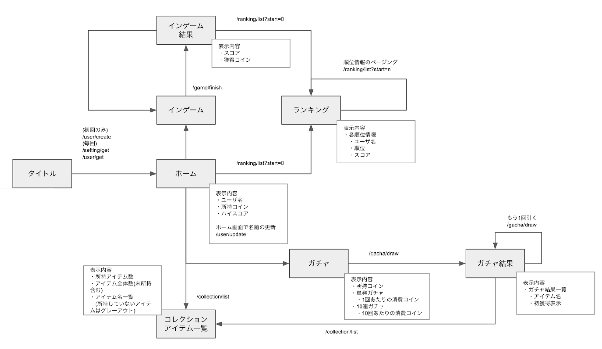

# 42tokyo-road-to-dojo-go

42Tokyo「Road to」CyberAgentカリキュラム用テンプレートリポジトリ

## はじめに
このカリキュラムではCyberAgentの育成型インターンシップ「CA Tech Dojo」の課題を体験して頂きます。

課題では以下の図のようなゲームを想定したAPIをGo言語を使用して実装していきます。



このカリキュラムでは以下のことについて学ぶことができます。

- APIサーバの開発の仕方
- リレーショナルデータベース(MySQL)の基礎的な使い方
- サーバーサイドアプリケーションへの通信の基礎
- Go言語を利用した開発の基礎
- APIサーバーの開発において注意すべき点

## 事前準備
### インストールが必要なもの
- Go
- docker / docker-compose
### docker-composeを利用したMySQL, Redisの準備
#### MySQL
MySQLはリレーショナルデータベースの1つです。
```
$ docker-compose up mysql
```
を実行することでローカルのDocker上にMySQLサーバが起動します。<br>

初回起動時に db/init ディレクトリ内のDDL, DMLファイルを読み込みデータベースの初期化を行います。<br>
テーブル設計を行い、DDL, DMLファイルを作成した場合はdb/initディレクトリへ配置しましょう。<br>
DDL, DMLファイルを再読み込みする場合は一度volumeを削除する必要があります。
```
# mysqlの停止
$ docker-compose down
# volumeの削除
$ docker volume rm 42tokyo-road-to-dojo-go_db-data
# 再起動
$ docker-compose up mysql
```

DDL(DataDefinitionLanguage): データベースの構造や構成を定義するためのSQL文<br>
DML(DataManipulationLanguage): データの管理・操作を定義するためのSQL文

#### Redis
Redisはインメモリデータベースの1つです。<br>
必須ではありませんが課題の中でキャッシュやランキングなどの機能でぜひ利用してみましょう。<br>
```
$ docker-compose up redis
```
を実行することでローカルのDocker上にRedisサーバが起動します。

## 課題内容
<p>
API仕様書に記載されている機能を実装してください。<br>
本課題ではフレームワークは利用せずに標準パッケージのnet/httpやdatabase/sqlを利用して実装をしましょう。<br>
また機能要件を満たすために必要なデータベースのテーブル設計も自身で行うこと。
</p>

### API仕様
API仕様はSwaggerUIを利用して閲覧します。
```
$ docker-compose up swagger-ui
```
を実行することでローカルのDocker上にSwaggerUIサーバが起動します。<br>
<br>
SwaggerUIサーバ起動後以下のURLからSwaggerUIへアクセスすることができます。

SwaggerUI: <http://localhost:3000/> <br> 
定義ファイル: `./api-document.yaml`<br>

### テーブル設計
実装に着手する前にデータベースのテーブル設計をしっかりと行いましょう。<br>
API仕様を読み込んでこのプロダクトにはどういったデータが必要なのか、どういったデータを保存する必要があるのかを洗い出しましょう。<br>
設計ができたらDDL, DMLファイルを作成し、db/initディレクトリへ配置をしてデータベースの初期化を行ってみましょう。

### 課題の実装順
以下のAPIの順で実装を行うこと。
1. /user/create
2. /user/get
3. /user/update
4. /collection/list
5. /ranking/list
6. /game/finish
7. /gacha/draw 

### 課題で考慮すべき点
- 2./user/get API以降共通
  - ユーザーの認証処理がmiddlewareとして実装されているか。<br>
    (各APIの実装全てに認証処理が記述されないこと)
- 4./collection/list
  - n+1問題が発生していないか。
  - コレクションアイテムのマスターデータがリクエストの度にMySQLに対しSELECTされていないか。<br>
    (マスターデータがAPIサーバーにキャッシュされているか)
- 5./ranking/list
  - n+1問題が発生していないか。
  - リクエストパラメータに不正な値が設定されている場合を考慮できているか。<br>
    (`start` パラメータにマイナス値やランキングに登録されているスコア数を超過した値が設定されている場合の考慮)
  - 不要なデータの取得を行っていないか。(ユーザーデータの全件取得等)
- 6./game/finish
  - リクエストパラメータに不正な値が設定されている場合を考慮できているか。<br>
    (`score` パラメータにマイナス値が設定されている場合の考慮)
- 7./gacha/draw
  - 各コレクションアイテムの排出確率の設定は排出内容のレコード数が変動することを前提に設計をすること。<br>
    例えば「排出するコレクションアイテムのレコードは必ず100件必要で、その100件のレコード毎に固定の排出確率を設定する」という設計はNG。(レコード数が増減したり、一部のレコードの排出確率の設定を変更することで排出確率の合計が必ず100%にならないという設計はNG)<br>
    排出内容毎に「重み」を定義し、レコード数が増減しても排出確率の合計が必ず100%になるようにすること。
  - リクエストパラメータに不正な値が設定されている場合を考慮できているか。<br>
    (`times` パラメータにマイナス値やAPIサーバやDBに負荷がかかってしまうような大きな値が設定されている場合の考慮)
  - n+1問題が発生していないか。
  - ガチャ排出確率に関するマスターデータがリクエストの度にMySQLに対しSELECTされていないか。<br>
    (マスターデータがAPIサーバーにキャッシュされているか)
  - コレクションアイテムのINSERTクエリが獲得数分発行されていないか。<br>
    (更新負荷がかかる仕組みになってしまうためINSERTクエリはまとめること)
  - Transactionを利用して原子性が担保されているか。<br>
    例えば処理の途中でエラーとなり、「コレクションアイテムが獲得できてコインが消費されていない」といった事象が発生しうる状態はNG。<br>
    (処理が途中でエラーになってしまっても中途半端なデータが保存されないこと)

## APIローカル起動方法
```
$ go run ./cmd/main.go
```

### ビルド方法
作成したAPIを実際にをサーバ上にデプロイする場合は、<br>
ビルドされたバイナリファイルを配置して起動することでデプロイを行います。
#### ローカルビルド
Macの場合
```
$ GOOS=linux GOARCH=amd64 go build -o dojo-api ./cmd/main.go
```

Windowsの場合
```
$ SET GOOS=linux
$ SET GOARCH=amd64
$ go build -o dojo-api ./cmd/main.go
```

このコマンドの実行で `dojo-api` という成果物を起動するバイナリファイルが生成されます。<br>
GOOS,GOARCHで「Linux用のビルド」を指定しています。
